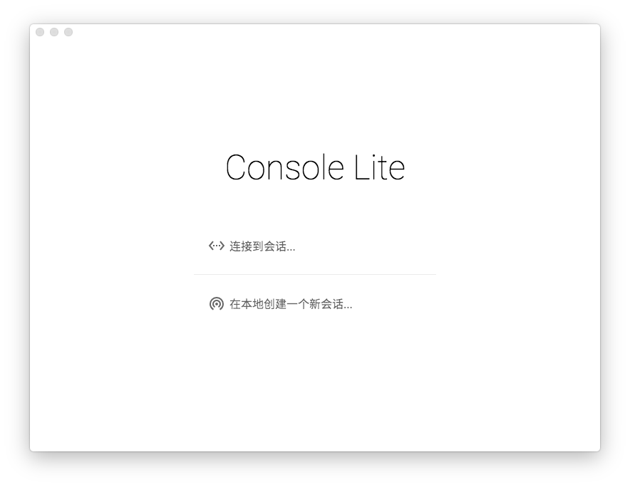

# Console Lite 使用手册 

Console Lite，/kˈɑnsoʊl/ /lˈaɪt/，翻译成中文是`控制台缩水版` (并不)，是一个模拟联合国会议软件。

Console Lite 拥有以下<small>十分厉害的</small>的功能：

- 支持多人协作，可以自动发现局域网内其他的实例并且连接
- 跨平台，支持 Mac OS X、Windows 以及大多数 Linux 发行版
- 拥有优雅的操作方法
- 占据震撼人心的硬盘空间 (例如：Windows 64位版本 300M)

## 下载

请前往 Console Lite 网站主页下载最新版本。

安装 Console Lite 十分简单，下载后开包即用。

启动 Console Lite 后，请继续阅读[起飞](./takeoff)

### 对于 macOS Serria 用户的提示

如果你正在使用 macOS Serria，Console Lite 可能不能在任意路径下执行，在启动本地会话时会提示错误。此时你需要将 Console Lite 的应用文件移动到 Finder 窗口左侧的`应用程序`，或 `/Application` 中。此后，从 Launchpad 启动 Console Lite，即可正常使用。

## 开放源代码

Console Lite 的全部源代码在 MIT 协议下开放，源码在 [Github](https://github.com/CircuitCoder/Console-Lite) 上。
