# 操作

在本节中我们会详细介绍 Console Lite 的操作方法。如果你在查找快捷键，我们也提供一个[快捷键清单](./cheatsheet)。

## 操作模式

与 Console 设计不同，Console Lite 不以会议进程为主线，而是以单独操作为主线。所以可以注意到，Console Lite 中不包含单独的动议、危机或者主发言名单。在 Console 中进行的操作可以在 Console Lite 中以如下相应的方式解决:

|Console|Console Lite|
|---|---|
|动议|无需对应操作，如果动议无人复议或者投票未通过，直接忽略|
|开启、返回主发言名单|创建一个名为`主发言名单`的发言名单，总时间为 0（不限）|
|有组织核心磋商|创建一个以议题为名的发言名单|
|自由磋商|创建一个计时器，并且投影|
|发布、展示文件|上传到文件中，并通过投影展示|
|对文件进行投票|创建一个名为`对文件xxx的投票`的投票|
|发布、展示危机|将危机写入一个 PDF 文件，上传到文件中，并通过投影展示|

以上提及的都是推荐的最佳实践，对于命名等具体细节可以根据情况进行调整。

## 连接到服务器

在 Console Lite 启动后，你可以选择在本地创建一个会话，或者连接到其他会话。如果你选择在本地创建一个回话，那么 Console Lite 会在内部启动一个服务器，并且生成密码。如果你选择连接到其他会话，Console Lite 会自动找到同一局域网内其他正在运行的服务器，你也可以直接填写 IP 连接其他不在同一局域网内的服务器。

在一次大会中，推荐每个委员会各自选取一台电脑作为主机在本地创建会话，并且开启 WiFi 热点，让其他电脑连接。注意，Console Lite 的协作模式不需要互联网，所以这台主机不需要连接到互联网，只要能构成一个局域网即可。

在连接其他服务器的时候，如果密码错误，Console Lite 会提示可以进行只读连接。在只读链接下，所有的文件、投票、出席状态等会议信息全部可见，但是无法作出更改。请注意，如果在 Console Lite 中保存有代表不能看到的信息，请保证代表无法连接到服务器上。一个最佳实践是为 WiFi 热点添加密码。

在 Console Lite 的任意位置按住 \` 键可以显示当前的连接设置。在本地启动会话可以通过这种操作查看服务器的 ID 和密码。

如果你是 Mac OS X 用户，关闭了控制窗口，Console Lite 不会退出。在下一次打开控制窗口的时候，如果你之前已经在本地创建了一个会话，点击在本地创建一个会话会自动连接到之前的会话上。

## 主页

在 Console Lite 主页中显示有当前活跃的发言名单、计时器以及投票。活跃的定义如下：

- 对于发言名单：
  - 某名代表正在发言，或者
  - 还有代表没有发言的
- 对于计时器：正在进行的。
- 对于投票：
  - 正在进行某轮投票的，或者
  - 有轮数限制，并且未达到的。

点击相应的发言名单或者投票可以直接进入到对应的页面中。点击计时器可以在计时器列表中筛选出该计时器。

## 席位

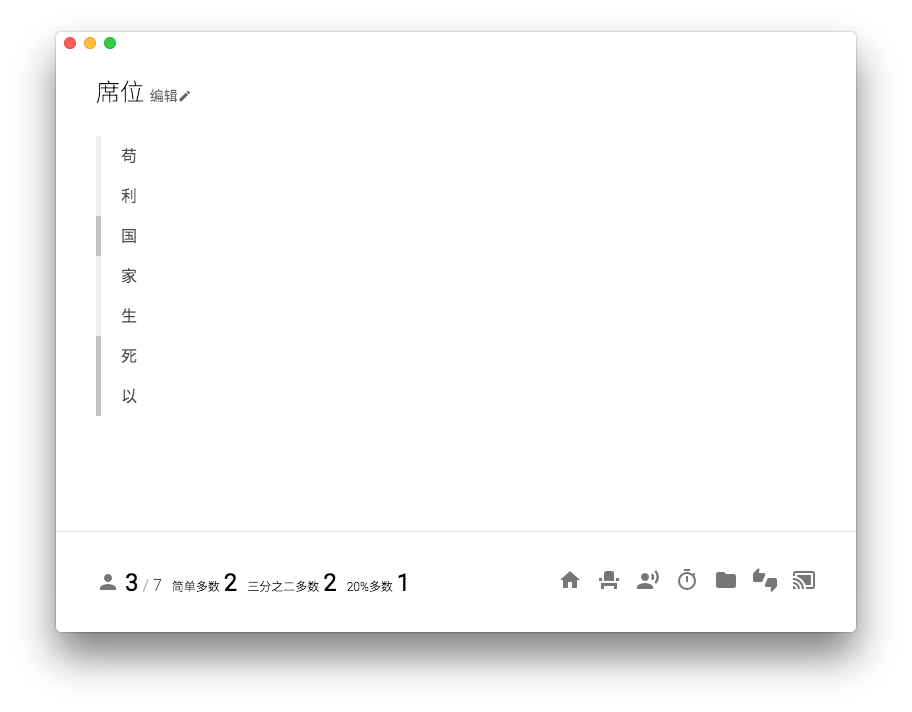

在席位页面，你可以修改会议的所有席位以及出席状况。

每个席位左侧的标记指示代表是否出席，深色的标记表示出席。点击席位名可以改变该席位的出席状态。

点击大标题右侧的编辑可以打开编辑席位对话框。与其他对话框相同，点击对话框周围的灰色区域意义是取消操作，如果需要提交操作请点击提交。修改席位名称或者出席状态不会对已经创建的投票和发言名单造成影响。

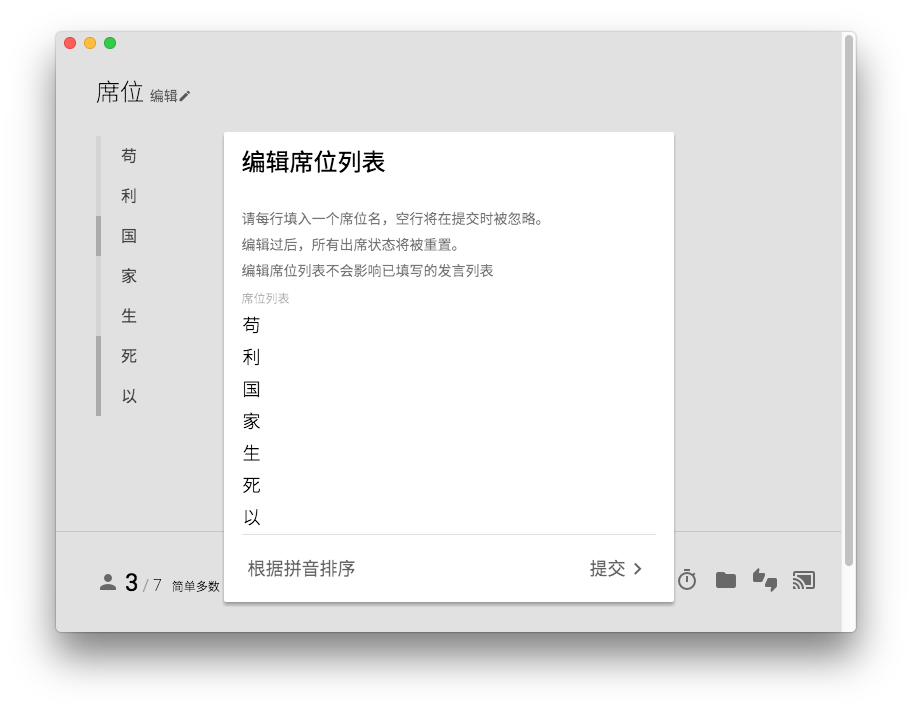

在这个对话框中，请每一行填入一个席位名。对话框还提供一个根据拼音排序的功能，第一次使用会消耗较长时间，请耐心等待。

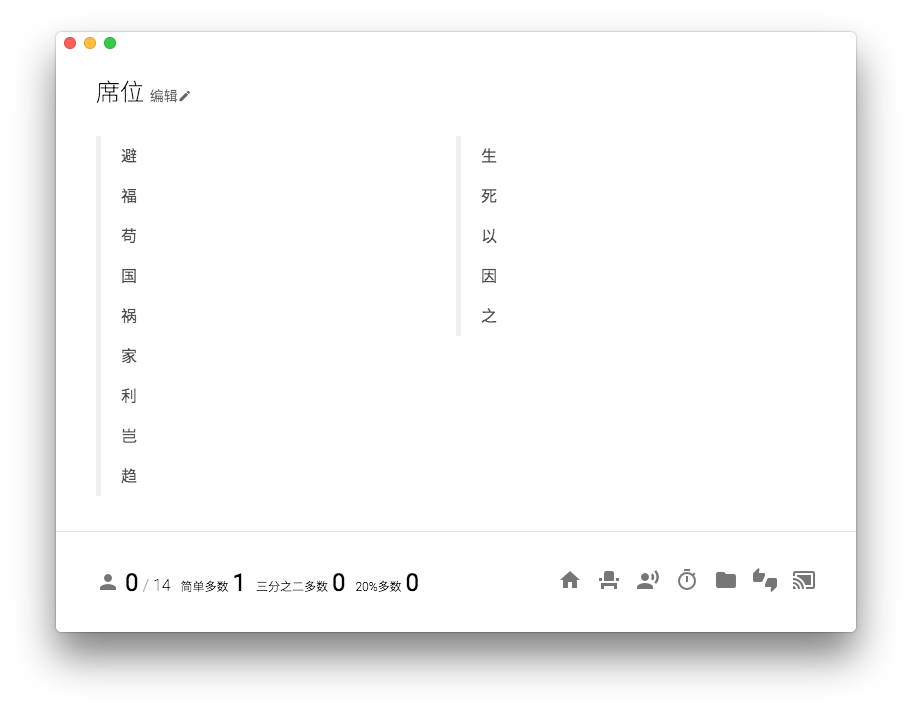

注意，Console Lite 不会去除重复的席位名，所以请自行检查，推荐的方法是使用拼音排序然后检查。

## 发言名单与列表

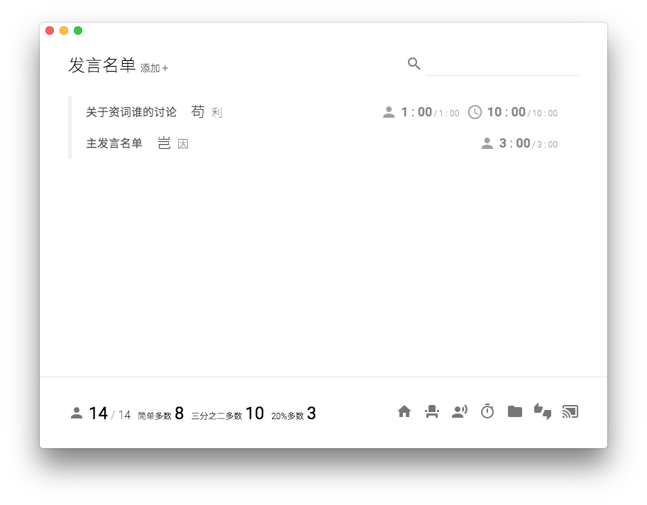

在发言名单列表页面，你可以创建新的发言名单。在创建发言名单的过程中，如果总时间留空，意义是不限总时间。推荐的命名方法是：主发言名单命名为“主发言名单”，有组织核心磋商以议题命名。

每一行数据的意义依次是：
- 发言名单名
- 当前发言席位
- 下一个发言席位
- 当前代表发言时间
- 发言名单剩余总时间

如果要延长一个有组织核心磋商，推荐直接修改现有发言名单的总时长，这样可以保留之前的发言记录。

创建发言名单后，点击发言名单可以进入名单的响应页面。

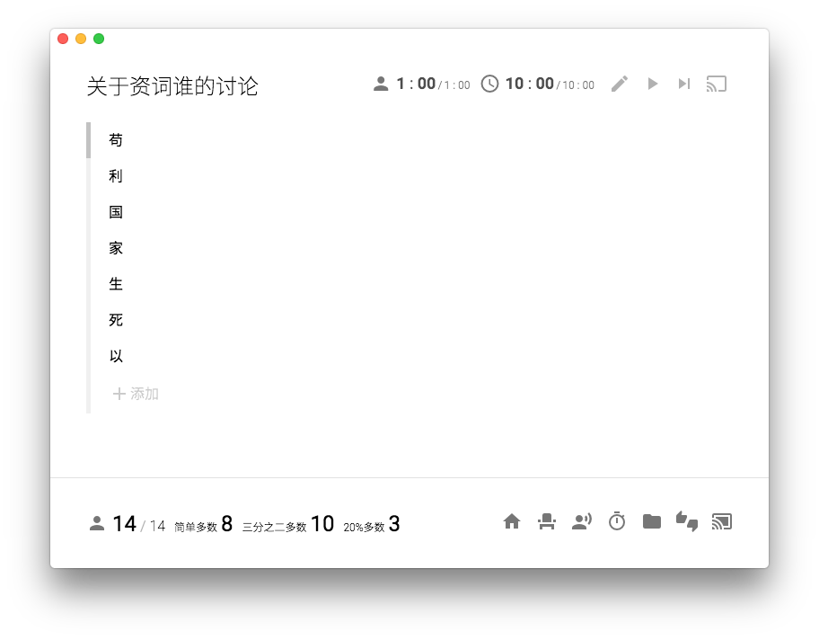

在这个界面中，显示有发言名单中所有的席位。被高亮的席位为正在发言的或者即将发言的席位。右上角的按钮意义分别为：
- 编辑总时长和每名代表时长
- 开始/继续记时
- 下一名代表
- 投影

点击添加可以在列表末尾添加一个席位。点击席位名可以编辑该位置的席位。在添加和编辑的过程中，按下 Esc 键取消，回车键确认，在添加时按下 Alt (Option) + 回车键可以**继续添加下一个席位**。

如果你将某个席位编辑为空，等于删除这个席位。

在编辑的过程中可以使用拼音补全。按方向键可以移动选中的行，按 Tab 键可以补全选中的行。直接使用鼠标点击有相同的效果。由于耗时的问题，Console Lite 不提供根据汉字的补全，如果你希望使用补全请不要用中文输入法输入。补全的内容包括当前所有出席的席位。

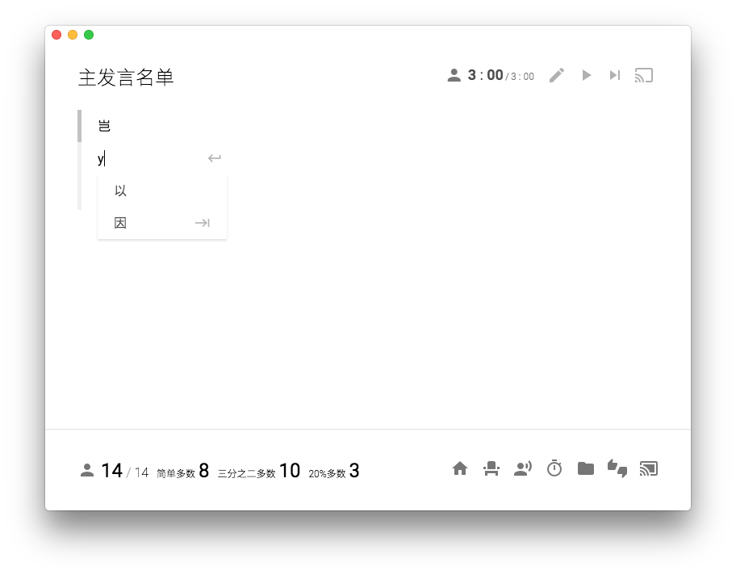

直接拖动席位可以改变它在列表中的位置，所以如果你要将一个席位移动到特定位置，不需要改变一路上所有的席位，直接拖动即可。

(由于奇妙的截图问题，这里没有图，你能感受到这个功能的炫酷就好了)

## 计时器列表

计时器列表页面已经在[起飞](./takeoff)一节中做出了充分的说明，在此不再赘述。

值得一提的是，对于自由磋商和茶歇等需要多次实用的计时器，推荐直接更改现有计时器的时间而不是新建一个同名计时器，虽然计时器之间名称不会产生冲突。一个例外是同名的计时器的剩余时间有保存的必要。在这种情况下，推荐在命名时加入额外的区分信息，例如会期、创建时间，等等。

## 文件与列表

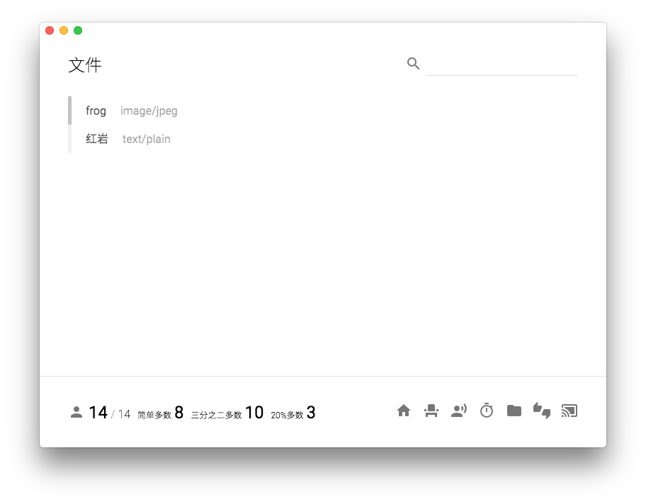

在文件列表页面，文件是通过拖拽的方式上传和修改的。直接将一个文件拖入文件列表页面可以上传，并且**不会覆盖同名文件**。被高亮的文件是新文件或者刚被更新的文件。

(同样，拖着东西不能截图，所以嘻嘻)

点击文件可以进入这个文件的页面。对于图片文件和 PDF，Console Lite 可以直接提供预览和投影功能，但是较为复杂的 PDF 会消耗较长的渲染时间。其他格式的文件不能预览，只能直接下载。在预览或者下载页面拖入一个相同类型的文件可以**更新**现有的文件，但是不会更新文件名；同时，如果在本台或者其他电脑上正在投影展示这个文件，投影不会更新，需要再在预览页面点击一次投影。

### 预览页面

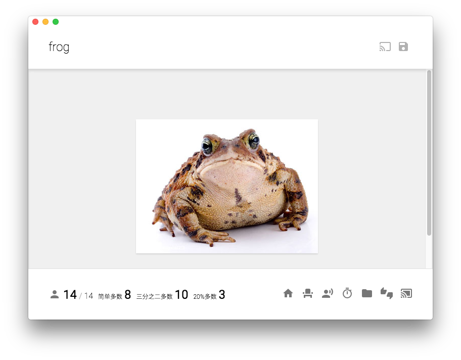

右上角的按钮依次为：
- 投影
- 保存

### 下载页面

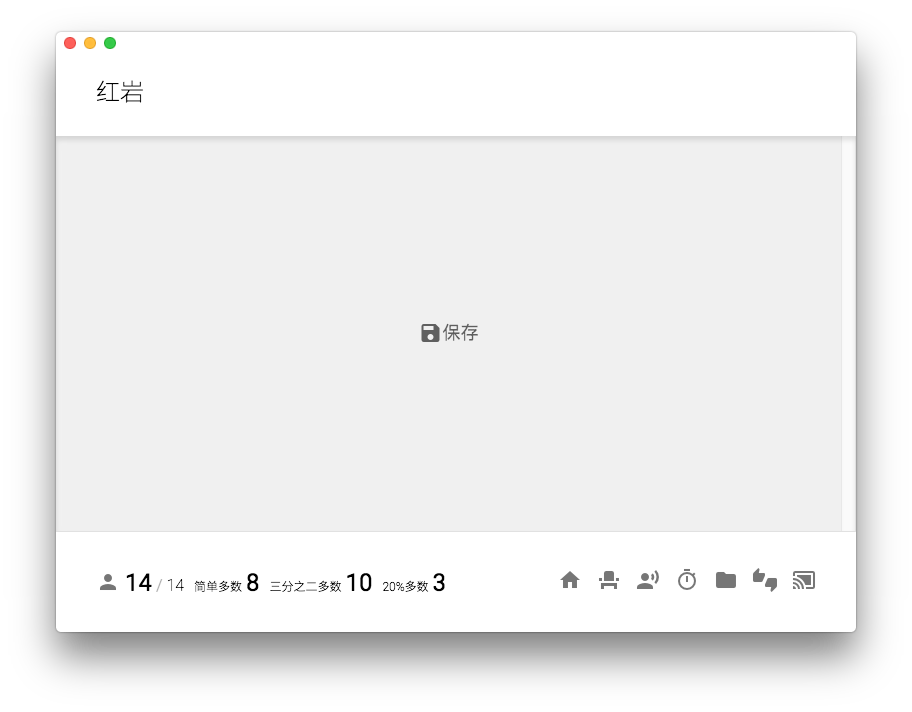

## 投票与列表

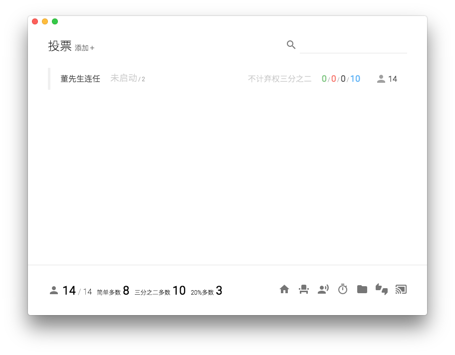

在投票页面，你可以添加新的投票或者进入投票的细节页面。在投票列表中，每一行中的数据从左至右意义如下：
- 投票名
- 当前轮数/总轮数
- 如果使用不计弃权三分之二多数，会显示不计弃权三分之二字样。
- 投票状态
  - 绿色：赞成
  - 红色：反对
  - 黑色：弃权
  - 蓝色：目标票数。如果投票使用不计弃权三分之二多数，计算目标票数会减去弃权票数，但是不会忽略未投票的席位。
- { 一个小人图标 } 参加的席位数

点击添加+按钮可以显示添加投票对话框，对话框内已经对每个选项的意义做出的说明。如下图片展示的是不计弃权三分之二没有被选中的状态：

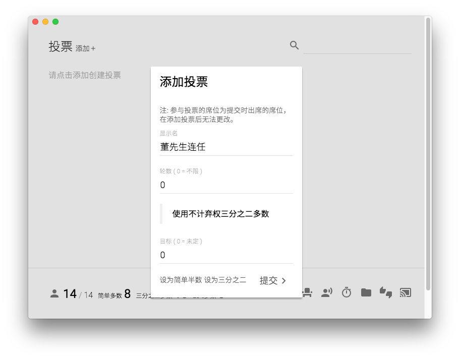

注意：投票是根据创建投票时出席的席位创建的。之后改变席位名或者出席状态不会对参与投票的席位造成任何一丁点的影响。

点击投票列表中的某一行可以进入该投票的细节页面。

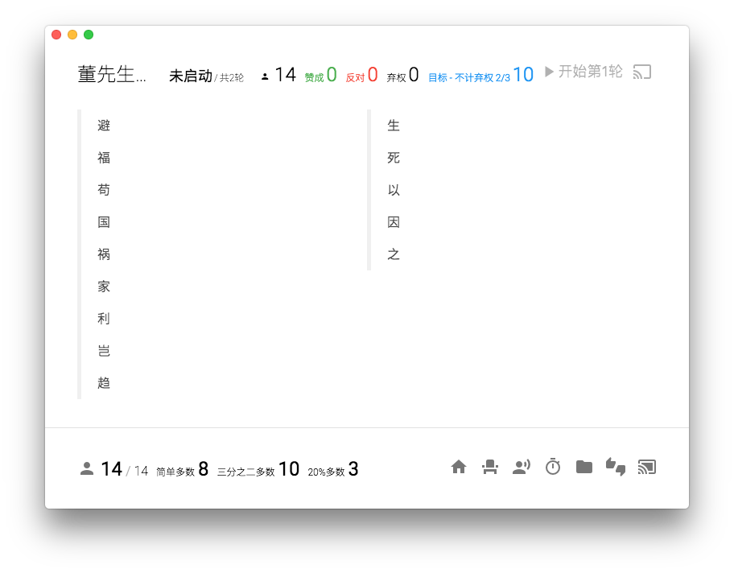

顶栏与列表中的一行基本相同，右上角的按钮分别为：
- 开始/结束某一轮投票
- 投影

一般而言，如果投票没有开始，右上角按钮会显示“开始第 x 轮“，除非所有席位都已经投票了。此时，右上角按钮会显示“手动开始第 x 轮”。前者会以自动模式开启下一轮，后者会以手动模式开启下一轮。二者的区别如下：

在自动模式中，Console Lite 会依次要求所有没有投票的席位投票。在所有没有投票的席位被遍历完成后，会自动结束这一轮投票。

在手动模式中，Console Lite 不会自动显示对话框，需要操作者点击席位名以修改对应席位的投票。修改完成后需要点击结束按钮。

额外的，在自动模式进行过程中，如果操作者通过点击对话框周围取消了某次操作，Console Lite 会在询问过后退回到手动模式。在点击开始按钮式按住 Alt (Option) 也可以强制进入手动模式。

在投票没有开始时，也可以通过类似手动模式的方法修改席位的投票结果，但是不鼓励这样做。

在投票结束时，Console Lite 会自动根据 没有投票/过 - 赞同 - 反对 - 弃权 的顺序排序所有的席位，排序结果会显示在控制窗口和投影窗口上

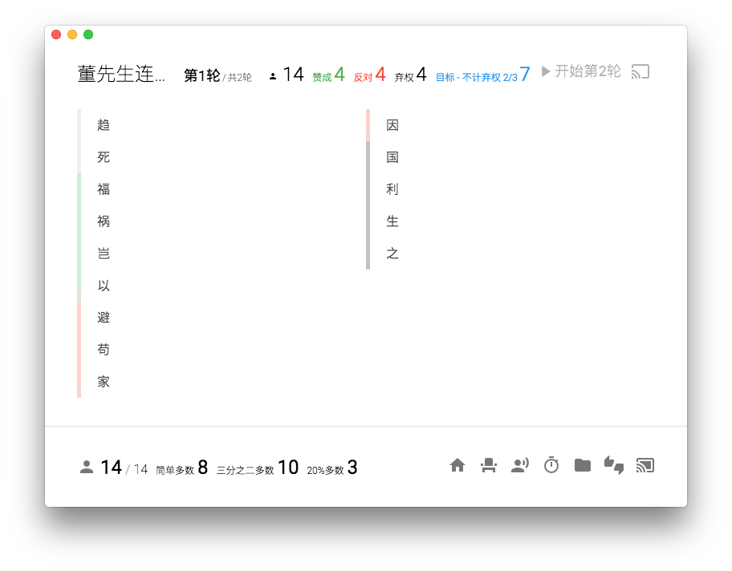

这是投票的投影界面:

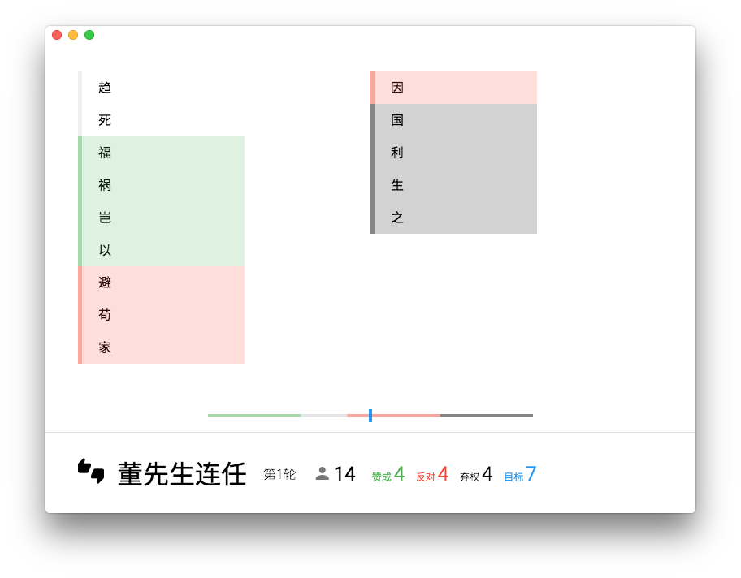

## 投影窗口

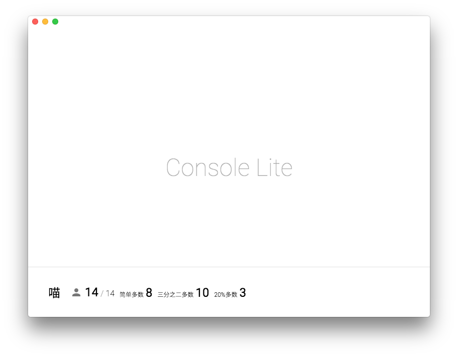

点击控制窗口最右下角的按钮可以打开或者关闭投影窗口。在其他页面点击相同的图标可以将相应的内容投影到投影窗口上。可以投影的内容包括：
- 文件
- 投票
- 发言名单
- 计时器

如果你是 Windows 用户，在投影窗口内单独按下一次 Alt 可以显示菜单栏，再按一次可以隐藏。**当菜单栏隐藏时，其中的快捷键仍然可用**。

值得一提的是，文件的更新不会反映到投影窗口上，需要操作者在操作窗口重新点击一次投影才会更新。

如果操作窗口被关闭，投影窗口也会被相应的关闭。如果操作窗口被刷新，投影窗口会被重置，消除显示的内容。如果需要重置投影窗口，可以按住 Alt (Option)，可以看到打开、关闭投影窗口的按钮发生了变化。此时，点击该按钮可以清除投影窗口中的内容。

## 搜索

在计时器、投票和文件的列表中，左上角包含有一个搜索框，可以通过这个搜索框筛选内容。
